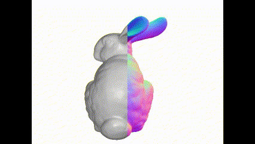

# Render_mesh
Render a mesh in spherical trajetory

## Example
Render the `bunny` in `example_data`
```sh
    python render_mesh.py
```
the render result is stored in `example_data/`, shown as following:




For headless rendering, please refer to [installation of Open3D](http://www.open3d.org/docs/release/tutorial/visualization/headless_rendering.html?highlight=headless)

## Acknowledgement
* Credits to [Open3D](https://github.com/isl-org/Open3D)!
* Credits to [sdfstudio](https://github.com/autonomousvision/sdfstudio)!
* Credits to [nerfstudio](https://github.com/nerfstudio-project/nerfstudio)!